# Plantory — Entity Relationship Diagram (V1 schema)

Generated from the migrations in `supabase/migrations/`. Every business table
carries `organization_id` (multi-tenant) and most operational tables carry
`outlet_id` — those columns are omitted from the diagram below for readability
but are present on every table and drive Row Level Security.

**Legend:** `||` one · `o{` many · `o|` optional-one. Cost-bearing tables
(`inventory_batches`, `purchase_*`, `sale_items`) are readable by Owner/Admin/
Manager only; Staff use the cost-free `get_outlet_stock()` RPC.

```mermaid
erDiagram
  organizations ||--o{ outlets : "has"
  organizations ||--o{ profiles : "has"
  organizations ||--|| org_settings : "config"
  organizations ||--o{ audit_logs : "logs"
  profiles ||--o{ user_outlets : "assigned"
  outlets ||--o{ user_outlets : "staffed by"

  organizations ||--o{ plant_categories : ""
  organizations ||--o{ plants : ""
  plant_categories |o--o{ plants : "groups"
  plants ||--o{ plant_sizes : "height+bag variants"
  plants ||--o{ plant_images : "photos"

  organizations ||--o{ suppliers : ""
  organizations ||--o{ customers : ""

  outlets ||--o{ purchases : "receives"
  suppliers |o--o{ purchases : "from"
  purchases ||--o{ purchase_items : ""
  purchases ||--o{ purchase_expenses : ""
  plants ||--o{ purchase_items : ""
  plant_sizes ||--o{ purchase_items : ""

  purchase_items |o--o{ inventory_batches : "creates"
  outlets ||--o{ inventory_batches : "stocks"
  plants ||--o{ inventory_batches : ""
  plant_sizes ||--o{ inventory_batches : ""
  inventory_batches |o--o{ stock_movements : "affects"
  outlets ||--o{ stock_movements : ""
  outlets ||--o{ stock_transfers : "from/to"
  stock_transfers ||--o{ stock_transfer_items : ""
  outlets ||--o{ plant_losses : ""
  plants ||--o{ plant_losses : ""

  plants ||--o{ plant_prices : ""
  plant_sizes ||--o{ plant_prices : ""

  outlets ||--o{ sales : ""
  customers |o--o{ sales : "buys"
  sales ||--o{ sale_items : ""
  plants ||--o{ sale_items : ""
  plant_sizes ||--o{ sale_items : ""
  sales |o--o{ payments : "customer_in"
  suppliers |o--o{ payments : "supplier_out"
  purchases |o--o{ payments : "supplier_out"
  sales ||--o{ returns : ""
  returns ||--o{ return_items : ""
  sale_items ||--o{ return_items : "refers"

  outlets ||--o{ expenses : ""
  outlets ||--o{ day_closes : "cash close"
  sales |o--o{ whatsapp_messages : ""
  customers |o--o{ whatsapp_messages : ""

  organizations {
    uuid id PK
    text name "nursery name (dynamic)"
    bool gst_enabled
    text whatsapp_number
  }
  outlets {
    uuid id PK
    uuid organization_id FK
    text name
    bool active
  }
  profiles {
    uuid id PK "= auth.users.id"
    uuid organization_id FK
    text full_name
    user_role role
    app_language preferred_language
    bool active
  }
  user_outlets {
    uuid id PK
    uuid user_id FK
    uuid outlet_id FK
  }
  org_settings {
    uuid organization_id PK
    cost_allocation_method cost_allocation_method
    numeric min_margin_pct
    numeric price_rounding_step
    user_role below_min_override_role
  }
  audit_logs {
    uuid id PK
    uuid actor_id FK
    text action
    text entity
    jsonb old_value
    jsonb new_value
  }
  plant_categories {
    uuid id PK
    text name_en
    text name_hi
  }
  plants {
    uuid id PK
    text common_name_en
    text common_name_hi
    text scientific_name
    text public_slug "unguessable, QR"
    bool active
  }
  plant_sizes {
    uuid id PK
    uuid plant_id FK
    numeric height_ft "plant height (feet)"
    text bag_size "e.g. 12in, 10x10"
    text label
  }
  plant_images {
    uuid id PK
    uuid plant_id FK
    text storage_path
    bool is_primary
  }
  suppliers {
    uuid id PK
    text name
    text gstin
  }
  customers {
    uuid id PK
    text name
    text whatsapp_number
    app_language preferred_language
  }
  purchases {
    uuid id PK
    uuid outlet_id FK
    uuid supplier_id FK
    purchase_status status
    numeric landed_total
  }
  purchase_items {
    uuid id PK
    uuid purchase_id FK
    uuid plant_id FK
    uuid size_id FK
    int quantity
    numeric unit_cost
    numeric landed_unit_cost
  }
  purchase_expenses {
    uuid id PK
    uuid purchase_id FK
    text label
    numeric amount
  }
  inventory_batches {
    uuid id PK
    uuid outlet_id FK
    uuid plant_id FK
    uuid size_id FK
    numeric landed_unit_cost
    int qty_received
    int qty_remaining
  }
  stock_movements {
    uuid id PK
    uuid batch_id FK
    stock_movement_type movement_type
    int quantity
    numeric unit_cost
  }
  stock_transfers {
    uuid id PK
    uuid from_outlet_id FK
    uuid to_outlet_id FK
  }
  stock_transfer_items {
    uuid id PK
    uuid transfer_id FK
    int quantity
  }
  plant_losses {
    uuid id PK
    uuid outlet_id FK
    loss_reason reason
    int quantity
  }
  plant_prices {
    uuid id PK
    uuid plant_id FK
    uuid size_id FK
    numeric min_price
    numeric recommended_price
    numeric retail_price
  }
  sales {
    uuid id PK
    uuid outlet_id FK
    uuid customer_id FK
    text invoice_no
    text invoice_token "unguessable"
    sale_status status
    numeric total
    uuid sold_by FK
  }
  sale_items {
    uuid id PK
    uuid sale_id FK
    text plant_name_snapshot
    int quantity
    numeric unit_price
    numeric cost_total "FIFO"
    numeric profit_total
    bool below_min
  }
  payments {
    uuid id PK
    payment_direction direction
    payment_method method
    numeric amount
  }
  returns {
    uuid id PK
    uuid sale_id FK
    return_type return_type
    numeric refund_amount
  }
  return_items {
    uuid id PK
    uuid return_id FK
    uuid sale_item_id FK
    int quantity
    bool restock
  }
  expenses {
    uuid id PK
    uuid outlet_id FK
    expense_category category
    numeric amount
  }
  day_closes {
    uuid id PK
    uuid outlet_id FK
    date business_date
    day_close_status status
    numeric expected_cash
    numeric counted_cash
    numeric variance
  }
  whatsapp_messages {
    uuid id PK
    uuid sale_id FK
    whatsapp_message_type message_type
    whatsapp_message_status status
  }
```

## Access-control quick reference

| Group | Tables | Who can read |
|-------|--------|--------------|
| Identity | organizations, outlets, profiles, user_outlets, org_settings | Org members (writes: Owner/Admin) |
| Catalogue | plant_categories, plants, plant_sizes, plant_images | Org members (writes: Owner/Admin); **public info via `get_public_plant()`** |
| Parties | suppliers | Owner/Admin/Manager · customers: all staff |
| Cost-bearing | purchases, purchase_items, purchase_expenses, inventory_batches, stock_movements, plant_losses | **Owner/Admin/Manager only** (Staff → `get_outlet_stock()`) |
| Pricing | plant_prices | Org members read (Staff need the floor); writes Owner/Admin |
| Sales | sales (header) | Outlet members · **sale_items (cost/profit): Manager+** · public invoice via `get_public_invoice()` |
| Ops | expenses, day_closes, whatsapp_messages | expenses: Manager+ · day_closes: outlet members · messages: org members |
